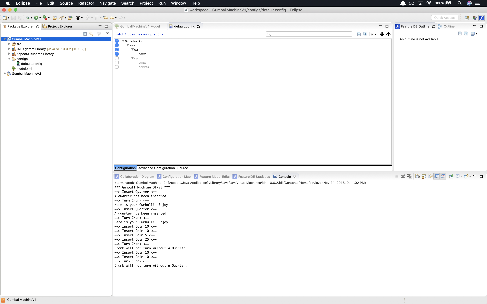
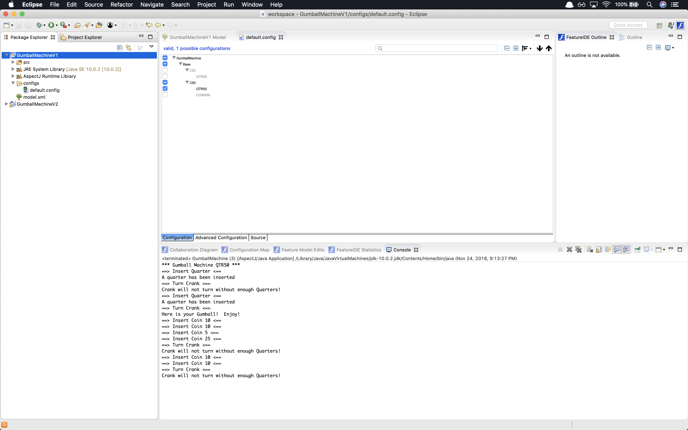
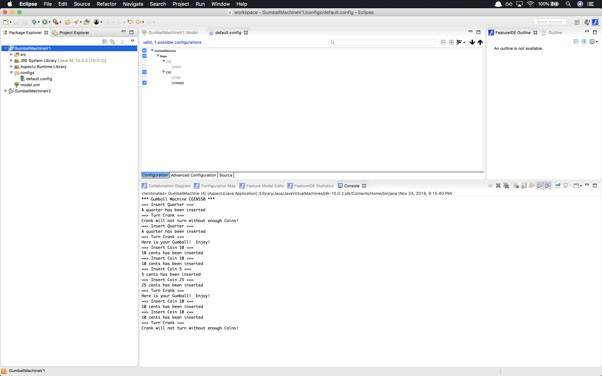
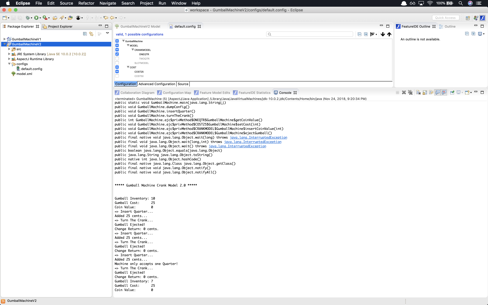
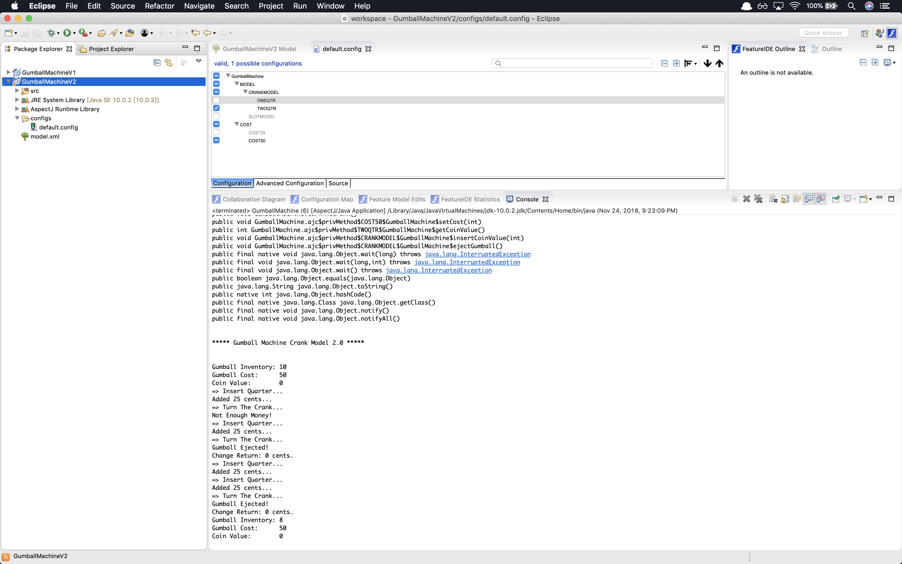
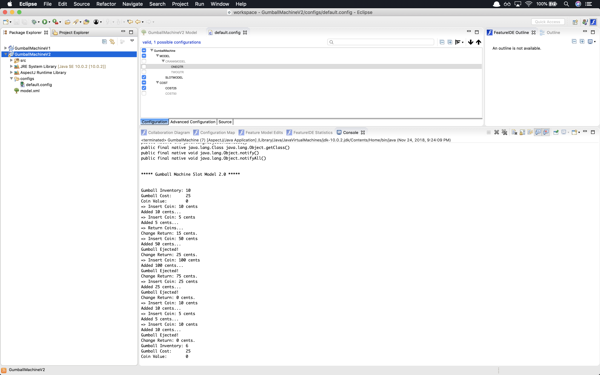
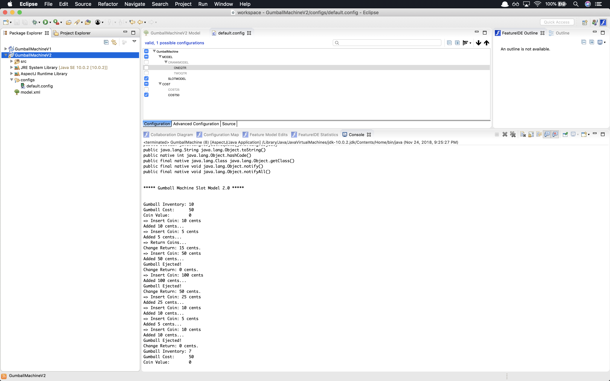

# Comparison

In Lab 1, to make necessary changes for Gumball Machine to support three different scenarios mentioned, I have made changes in the constructor to accept cost and type of coins that Machine can Accept. If there are additional features to support then it would cause problems

In Lab 10, Features are modeled using AOP. With the help of features and constraints on it, it is now easy to accomodate new features. Required configurations are maintained using default.config file. 
# Results

## GumballMachineV1

## GumballMachineV2

